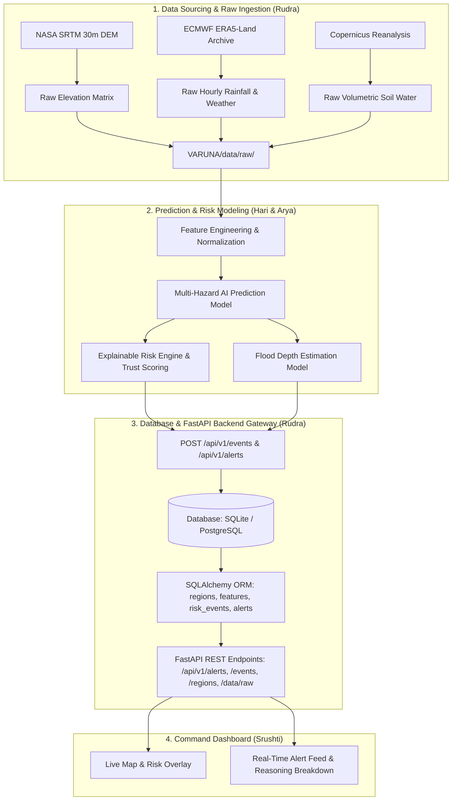
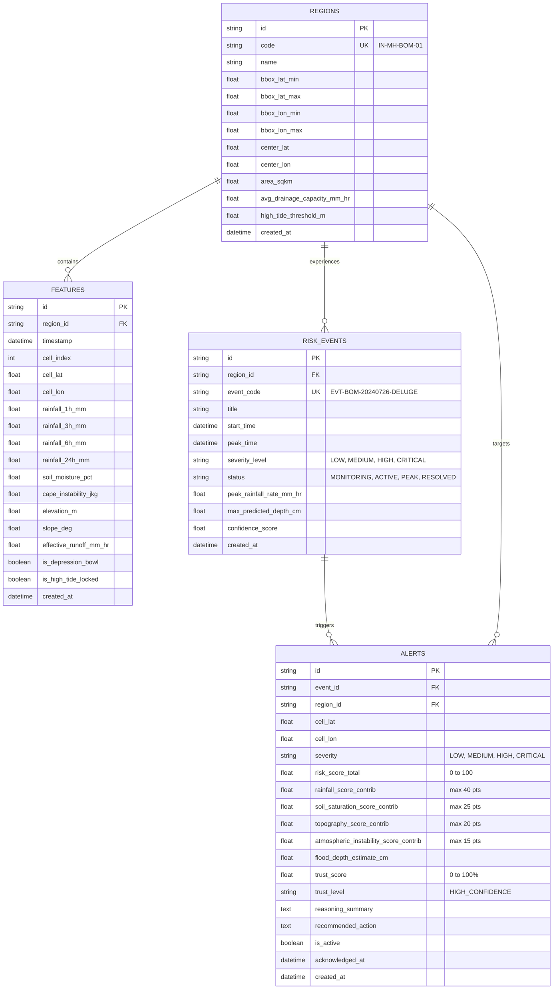

## 📍 Pilot Study: Mumbai Urban Flood Corridor

* **Region Code**: `IN-MH-BOM-01`
* **Spatial Extent**: Latitude $[18.980^\circ\text{N}, 19.160^\circ\text{N}]$, Longitude $[72.800^\circ\text{E}, 72.960^\circ\text{E}]$
* **Resolution**: $0.02^\circ$ ($10 \times 9 = 90$ distinct spatial micro-cells)
* **Critical Monitored Hotspots**:
  * **Hindmata / Dadar TT Circle** ($3.2\text{m}$ MSL — severe tidal depression bowl)
  * **Kurla West & LBS Marg** (Mithi River confluence & railway nexus)
  * **Bandra-Kurla Complex (BKC) Outfall** (Vakola nullah discharge)
  * **Sion Circle & Gandhi Market** (Low-lying highway underpass)
  * **Andheri Subway** (Rapid flash-flood trap)
  * **Mahim Bay Outfall** (Tidal lock gate during spring surges)

---

## 🏗️ System Architecture & Team Boundaries



---

## 🗄️ Database Schema



---

## 🔬 Raw Data Access for Prediction Model Team

All raw datasets are stored **untouched without preprocessing** under `VARUNA/data/raw/`:

```python
import pandas as pd

# 1. Load raw DEM topography elevation points
df_dem = pd.read_csv('data/raw/dem/mumbai_srtm_dem_raw.csv')
# Columns: cell_id, latitude, longitude, elevation_meters

# 2. Load raw historical rainfall and meteorological series
df_rain = pd.read_csv('data/raw/rainfall/mumbai_hourly_rainfall_raw.csv')
# Columns: timestamp, precipitation_mm, temperature_c, relative_humidity_pct, surface_pressure_hpa, soil_moisture_0_to_7cm_m3m3
```

---

## 🚀 Quick Start Guide

### 1. Prerequisites & Environment Setup
```bash
# Clone the repository
git clone https://github.com/your-org/VARUNA.git
cd VARUNA

# Create and activate virtual environment
python -m venv .venv
# On Windows:
.venv\Scripts\activate
# On Linux/macOS:
source .venv/bin/activate

# Install dependencies
pip install -r backend/requirements.txt
```

### 2. Download Raw Datasets & Initialize Database
```bash
# Ingest raw NASA SRTM & ECMWF datasets (100% free, no API keys needed)
python data_pipeline/raw_dataset_downloader.py

# Initialize SQLite/PostgreSQL schema and seed pilot region
python data_pipeline/seed_db.py
```

### 3. Run FastAPI Backend Server
```bash
python backend/run.py
```
* **Interactive OpenAPI Docs**: [http://localhost:8000/docs](http://localhost:8000/docs)
* **Health Check & Diagnostics**: [http://localhost:8000/api/v1/health](http://localhost:8000/api/v1/health)

### 4. Run Automated Test Suite
```bash
python backend/test_api.py
```

---

## 🌐 REST API Reference

| Method | Endpoint | Description |
|---|---|---|
| `GET` | `/api/v1/health` | System health check and database diagnostics |
| `GET` | `/api/v1/data/raw/catalog` | Catalog of raw CSV/JSON files for the ML team |
| `GET` | `/api/v1/data/raw/dem` | Raw DEM elevation points |
| `GET` | `/api/v1/data/raw/rainfall` | Raw hourly rainfall time series |
| `GET` | `/api/v1/regions` | List registered pilot regions |
| `GET` | `/api/v1/regions/{code}/hotspots` | Critical urban flood hotspots |
| `GET` | `/api/v1/features/latest` | Latest 90-cell spatial grid snapshot |
| `GET` | `/api/v1/events` | List tracked hazard events |
| `GET` | `/api/v1/alerts` | Query active/historical alerts with severity filters |
| `GET` | `/api/v1/alerts/{id}/explain` | **Explainability & Trust Breakdown** (Decomposition & Playbook) |
| `POST` | `/api/v1/alerts/{id}/acknowledge` | Emergency operator alert acknowledgement |
| `GET` | `/api/v1/replay/status` | Current storm simulation status |
| `POST` | `/api/v1/replay/step` | Advance storm simulation 1 timestep or jump to peak |
| `POST` | `/api/v1/replay/reset` | Reset simulation to pre-storm baseline |


